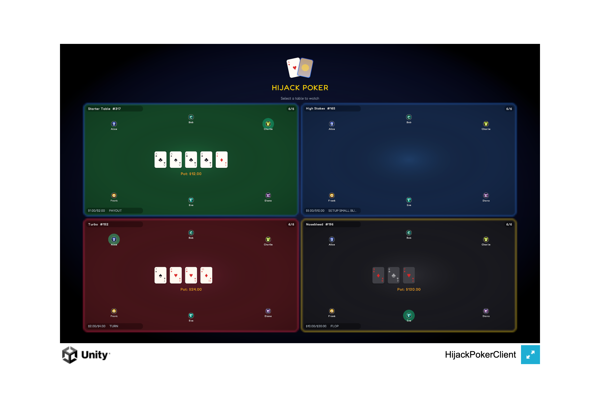
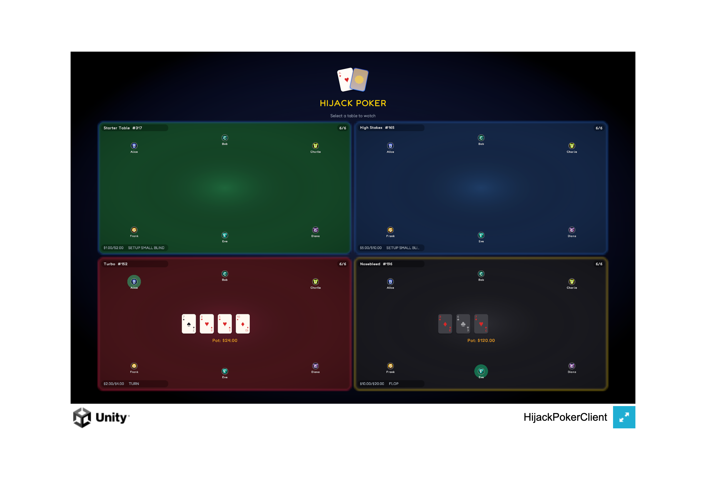
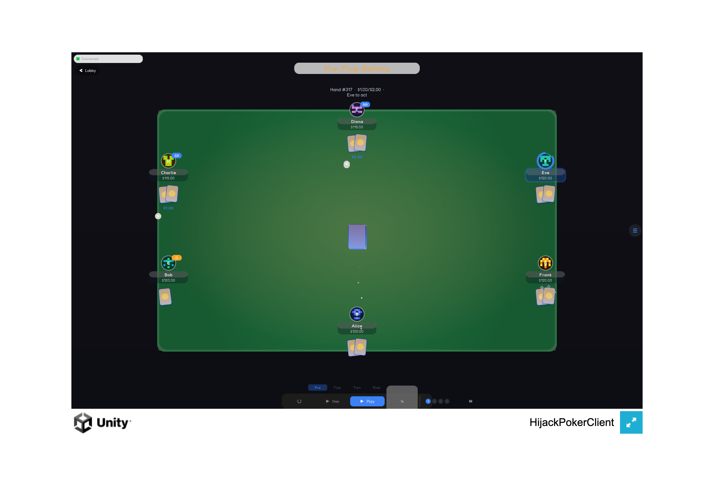
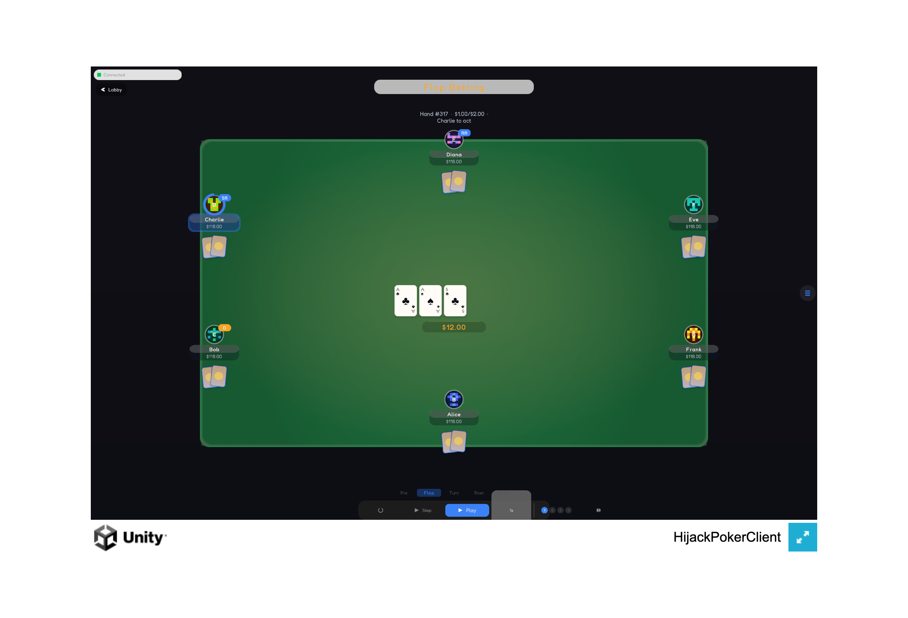
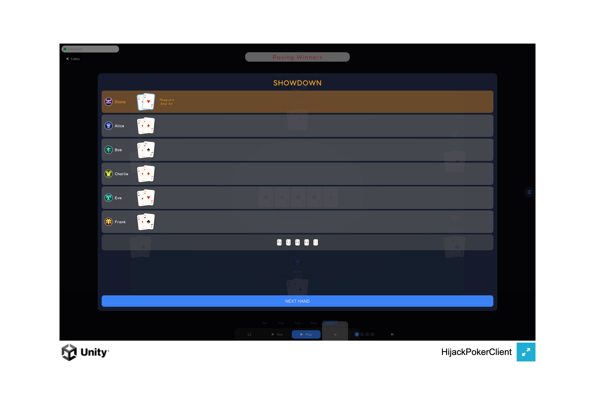

# Hijack Poker — Unity Game Client (Option D)

## Why Option D

I chose the Unity Game Client because it offered the most interesting rendering and state management challenges: building a real-time poker table viewer with animated card dealing, pot distribution, and winner presentation — all driven by a WebSocket event stream. Unity's programmatic UI approach also let me demonstrate strong software design without relying on scene files or visual editors.

## Screenshots


*Redesigned lobby — 4 themed table previews with procedural avatars, live game states, and entrance animations*


*Table lobby with live previews — select a table to watch*


*Pre-flop betting with dealt hole cards, procedural avatars, chip stacks, active player glow, and HUD*


*Flop betting with community cards, liquid pot counter, position badges, and 6-player seating*


*Showdown overlay — winner highlighted with hand rankings, all cards revealed with glint sweeps*

## Setup Instructions

### Prerequisites

- **Unity 6** (6000.0+) — [Download](https://unity.com/releases/editor/archive)
- **Docker Desktop** with Docker Compose v2

### 1. Start the backend

```bash
cp .env.example .env
docker compose --profile engine up -d
```

Or use `make backend` from the `unity-client/` directory.

Verify the backend is running:

```bash
curl http://localhost:3030/health
# → {"service":"holdem-processor","status":"ok","timestamp":"..."}
```

### 2. Open the Unity project

```bash
make open
```

Or manually: Unity Hub → Add project from disk → select `unity-client/` → Open in Unity 6.

Press **Play** — the client bootstraps automatically via `[RuntimeInitializeOnLoadMethod]`. No scene setup required.

### 3. Run tests

```bash
make test
```

Or in the Editor: **Window > General > Test Runner > EditMode > Run All**.

### 4. Build & serve

```bash
make build-webgl     # Build WebGL player
make build-desktop   # Build macOS desktop app
make build-ios       # Export iOS Xcode project
make serve           # Serve WebGL build on http://localhost:8090
make clean           # Remove Builds/ and Logs/
```

### 5. E2E tests

```bash
make e2e             # Run all Playwright E2E tests
make e2e-api         # API E2E tests only
make e2e-viewer      # Hand viewer E2E tests only
make e2e-webgl       # WebGL smoke E2E tests only
```

### 6. Deploy

```bash
make deploy          # Deploy all services to Railway
```

Run `make help` for the full list of targets. Override the Unity path with `UNITY_PATH=/path/to/Unity make build-webgl`.

## What's Implemented vs. Deferred

| Feature | Status | Notes |
|---------|--------|-------|
| Table lobby with live previews | Implemented | 4 themed tables with polling, entrance animations, and mini table views |
| Real-time hand viewer | Implemented | Full state machine playback for all 16 hand steps |
| WebSocket connection | Implemented | Primary transport with auto-reconnect |
| REST fallback | Implemented | Falls back to polling when WebSocket is unavailable |
| Procedural player avatars | Implemented | Pattern-based avatars (AvatarCircleView, AvatarPatternGenerator, AvatarBorderController) |
| Chip stack visualization | Implemented | 4 denominations with stacked chip rendering (ChipStackView) |
| Turn timer arc | Implemented | Animated arc with color transitions (TurnTimerView) |
| Session statistics tracking | Implemented | Hands seen, win rate, biggest pot (SessionTracker + PlayerStatsTooltip) |
| Animation timeline system | Implemented | Composable fluent sequence builder (Timeline.cs) |
| Particle pooling | Implemented | Pre-allocated 80 particles to avoid GC spikes (ParticlePool) |
| Centralized animation config | Implemented | Per-group speed control (AnimationConfig) |
| Loading overlay | Implemented | Pulsing text overlay during connection (LoadingOverlay) |
| Showdown overlay | Implemented | Dedicated modal with hand rankings (ShowdownOverlay) |
| All-in impact effects | Implemented | Screen-shake and particle burst on all-in (AllInImpactEffect) |
| Card reveal tiers with glint sweeps | Implemented | Tiered reveal intensity based on hand strength (CardRevealEffects) |
| Screen shake on events | Implemented | Camera shake for dramatic moments (ScreenShakeEffect) |
| Hand strength classification | Implemented | Classify hands for visual effect tiers (HandStrengthClassifier) |
| Sparkle/shimmer effects | Implemented | Particle sparkle on winners (SparkleEffects) |
| Kinetic phase labels | Implemented | Animated phase text transitions (KineticPhaseLabel) |
| Liquid pot counter | Implemented | Smoothly animated pot total (LiquidPotCounter) |
| Scene transitions | Implemented | Fade transitions between lobby and table (SceneTransition) |
| Table themes | Implemented | Per-table color schemes (TableTheme) |
| Table atmosphere | Implemented | Ambient particle effects per table (TableAtmosphereController) |
| Card preview on click | Implemented | Enlarged card overlay (CardPreviewOverlay) |
| Animated card dealing | Implemented | Clockwise deal from center deck position |
| Card flip animations | Implemented | 3D-style flip with scale tweening |
| Pot distribution animation | Implemented | Chips fly from pot to winner stacks |
| Shuffle/reset animation | Implemented | End-of-hand sweep and visual shuffle |
| Winner glow + presentation | Implemented | Pulsing glow ring on winner seats |
| Community card reveal | Implemented | Staged reveal for flop (3), turn, river |
| HUD (phase, pot, blinds) | Implemented | Kinetic phase labels, liquid pot total, hand number, blind levels |
| Hand history log | Implemented | Collapsible scrollable step-by-step log |
| Auto-play mode | Implemented | Configurable speed (1-5x), continuous hand progression |
| Background auto-play | Implemented | Tables keep advancing via POST /process while in lobby |
| Table context persistence | Implemented | Switch tables without losing state, auto-play status, or scroll position |
| Lobby pill navigation | Implemented | Back-to-lobby button from table view |
| Procedural audio | Implemented | Runtime-generated SFX (deal, chip, fold, win) |
| Connection status indicator | Implemented | Colored dot with state text |
| Multi-platform builds | Implemented | macOS, WebGL, iOS build pipelines |
| Safe area support | Implemented | iOS notch/home indicator insets |
| Responsive layout | Implemented | Grid-based seat layout adapts to window size |
| Mute toggle | Implemented | Toggle all procedural audio |
| E2E test support | Implemented | Playwright-based API, viewer, and WebGL smoke tests |
| Card art sprites | Deferred | Cards display rank + suit as text |
| Rounded corners | Deferred | uGUI Image renders as rectangles |
| Persistence | Deferred | Settings reset each session (no PlayerPrefs) |
| Play Mode tests | Deferred | Would require MonoBehaviour lifecycle mocking |

## Architecture

### Data Flow

```
Lobby (polls GET /table/{1-4}) → user selects table
                ↓
    SceneTransition fade
                ↓
    ConnectionManager (WS + REST)
                ↓
    TableStateManager.UpdateState()
                ↓
    OnStateChanged event fires
                ↓
    ┌───────────────┼───────────────┐
    ↓               ↓               ↓
 SeatViews    CommunityCards     HudView
 CardViews     HandHistory      Controls
```

### Key Architectural Decisions

| Decision | Rationale |
|----------|-----------|
| **Programmatic UI (no scene files)** | Scene YAML is impossible to merge in git. All layout logic lives in diffable `.cs` files. No hidden inspector state — every color, size, and position is visible in code. |
| **Singleton bootstrap via `[RuntimeInitializeOnLoadMethod]`** | Any scene works — no scene dependencies, no prefab wiring. Single entry point with `DontDestroyOnLoad`. |
| **Event-driven state (`TableStateManager`)** | Decouples data from rendering. Views subscribe to `OnStateChanged` and update independently. |
| **WebSocket primary, REST fallback** | WebSocket gives sub-100ms state delivery. If WS fails, the client transparently degrades to REST polling with no user action required. |
| **Timeline animation sequencing** | Composable fluent API replaces nested callback chains. Each animation step is a `Timeline` node — easier to read, reorder, and debug. |
| **ParticlePool object pooling** | Pre-allocates 80 particles to avoid GC spikes during effects. Particles are recycled rather than instantiated per-use. |
| **Lobby with live table previews** | Polls all 4 tables, shows mini table views with real game state. Users see action before choosing a table. |
| **Table context persistence** | Switching tables saves/restores state, auto-play status, and scroll position. No data loss when navigating. |
| **Background auto-play** | Tables continue advancing via POST /process while user is in lobby. Returning to a table shows up-to-date state. |
| **Cancel-snap animation pattern** | When users click "Next Step" mid-animation, all active tweens snap to their final values instantly, then the new step processes. No visual artifacts from interrupted animations. |
| **Procedural audio** | Zero external dependencies — SFX clips are generated at runtime via `AudioClip.Create` with synthesized waveforms. |
| **Deferred stack tweens** | Winner stack amounts update only after the pot fly-in animation lands, creating a causal visual sequence. |
| **async/await with `Awaitable`** | Unity 6 native async support. API calls, auto-play timing, and reconnection all use `Task`-based patterns. |

### Connection Management

1. Startup: health check with exponential backoff (1s → 2s → 4s → 8s)
2. WebSocket connect to `ws://localhost:3032`
3. If WS fails: REST-only mode via `GET /table/{tableId}`
4. After `POST /process`: wait up to 3s for WS state delivery, then fall back to REST
5. On WS disconnect: switch to REST, attempt WS reconnect in background

### Project Structure

```
Assets/Scripts/
├── Api/
│   ├── PokerApiClient.cs          REST client (UnityWebRequest)
│   ├── WebSocketClient.cs         WebSocket client (System.Net.WebSockets)
│   ├── WebGLWebSocketClient.cs    WebGL-specific WS via JS interop
│   └── ServerConfig.cs            Centralized server URL configuration
├── Animation/
│   ├── AnimationController.cs     Active tween tracker, CancelAll()
│   ├── AnimationConfig.cs         Per-group speed control (deal, flip, pot, etc.)
│   ├── Timeline.cs                Composable animation sequence builder
│   ├── ParticlePool.cs            Pre-allocated particle recycling pool
│   ├── Tweener.cs                 Static tween factories (float, color, position, flip, pulse)
│   ├── DealAnimator.cs            Clockwise card deal from center deck
│   ├── ShuffleAnimator.cs         End-of-hand sweep + shuffle visual
│   ├── PotDistributionAnimator.cs Pot fly-in to winner stacks
│   ├── AllInImpactEffect.cs       Screen-shake + particle burst on all-in
│   ├── CardRevealEffects.cs       Tiered card reveals with glint sweeps
│   ├── SparkleEffects.cs          Winner sparkle/shimmer particles
│   ├── ScreenShakeEffect.cs       Camera shake for dramatic moments
│   ├── HandStrengthClassifier.cs  Hand classification for visual effect tiers
│   ├── SeatCardAnimator.cs        Per-seat card animation controller
│   └── SeatGlowController.cs      Winner glow pulse ring
├── Managers/
│   ├── GameManager.cs             Singleton bootstrap, orchestrator
│   ├── TableStateManager.cs       State holder, OnStateChanged event
│   ├── ConnectionManager.cs       WS/REST lifecycle, reconnection
│   ├── AutoPlayManager.cs         Timed auto-advance loop
│   ├── AudioManager.cs            Procedural SFX generation and playback
│   ├── SessionTracker.cs          Session statistics (hands, wins, biggest pot)
│   └── TableContext.cs            Per-table state persistence across switches
├── Models/
│   ├── GameState.cs               Game data + API response DTOs
│   └── PlayerState.cs             Player data + status convenience properties
├── UI/
│   ├── UIFactory.cs               Static UI creation helpers, color palette
│   ├── LobbyView.cs               Table lobby with 4 live table previews
│   ├── TablePreviewCard.cs        Mini table view for lobby
│   ├── TableView.cs               Background + oval felt surface
│   ├── SeatView.cs                Player seat with all sub-elements
│   ├── CardView.cs                Card rendering + flip animation
│   ├── BetChipView.cs             Bet amount chip display
│   ├── ChipStackView.cs           4-denomination chip stack visualization
│   ├── SeatBadgeView.cs           Action/status badge overlay
│   ├── CommunityCardsView.cs      5 center card slots with reveals
│   ├── HudView.cs                 Phase label, pot, hand #, blinds
│   ├── ControlsView.cs            Buttons, auto-play, speed, mute
│   ├── ConnectionStatusView.cs    Colored dot + state text
│   ├── HandHistoryView.cs         Scrollable step-by-step log
│   ├── AvatarCircleView.cs        Procedural player avatar circle
│   ├── AvatarPatternGenerator.cs  Deterministic pattern generation from player ID
│   ├── AvatarBorderController.cs  Animated avatar border effects
│   ├── LoadingOverlay.cs          Pulsing text overlay during connection
│   ├── ShowdownOverlay.cs         Dedicated showdown results modal
│   ├── TurnTimerView.cs           Animated turn timer arc with color transitions
│   ├── CardPreviewOverlay.cs      Enlarged card view on click
│   ├── PlayerStatsTooltip.cs      Session stats popup per player
│   ├── KineticPhaseLabel.cs       Animated phase text transitions
│   ├── LiquidPotCounter.cs        Smoothly animated pot total
│   ├── SceneTransition.cs         Fade transitions between lobby and table
│   ├── TableTheme.cs              Per-table color schemes
│   ├── TableAtmosphereController.cs  Ambient particle effects per table
│   ├── TextureGenerator.cs        Runtime texture/sprite creation
│   ├── InputHandler.cs            Keyboard shortcut handler
│   ├── LayoutConfig.cs            Responsive layout constants
│   └── SafeAreaPanel.cs           iOS safe area inset handler
└── Utils/
    ├── CardUtils.cs               Parse card strings → rank, suit, symbol, color
    ├── MoneyFormatter.cs          $X,XXX.XX formatting
    ├── ShowdownLogic.cs           Card visibility rules (pure static)
    ├── PhaseLabels.cs             Step number → human-readable label
    └── MockStateFactory.cs        Test data factory

Assets/Tests/EditMode/
├── CardUtilsTests.cs
├── CardUtilsEdgeCaseTests.cs
├── MoneyFormatterTests.cs
├── MoneyFormatterEdgeCaseTests.cs
├── ShowdownLogicTests.cs
├── ShowdownLogicEdgeCaseTests.cs
├── PhaseLabelsTests.cs
├── GameStateTests.cs
├── GameStateEdgeCaseTests.cs
├── PlayerStateTests.cs
├── TableStateManagerTests.cs
├── TableStateManagerEdgeCaseTests.cs
├── ApiClientTests.cs
├── AnimationControllerTests.cs
├── TweenHandleTests.cs
├── TextureGeneratorTests.cs
├── StateIntegrationTests.cs
├── ChipStackViewTests.cs
├── SessionTrackerTests.cs
├── TurnTimerViewTests.cs
├── ShowdownOverlayTests.cs
└── TimelineTests.cs
```

## API Documentation

The client consumes 3 REST endpoints and 1 WebSocket stream from `holdem-processor`.

### REST Endpoints

#### `GET /health`

Health check. Returns 200 when the service is ready.

```json
{
  "service": "holdem-processor",
  "status": "ok",
  "timestamp": "2024-01-15T10:30:00.000Z"
}
```

#### `POST /process`

Advances the hand by one state machine step.

**Request:**
```json
{ "tableId": 1 }
```

**Response:**
```json
{
  "success": true,
  "result": {
    "status": "ok",
    "tableId": 1,
    "step": 5,
    "stepName": "PRE_FLOP_BETTING"
  }
}
```

#### `GET /table/{tableId}`

Returns the full table state (game + players).

**Response:**
```json
{
  "game": {
    "id": 1,
    "tableId": 1,
    "tableName": "Table 1",
    "gameNo": 42,
    "handStep": 7,
    "stepName": "FLOP_BETTING",
    "dealerSeat": 1,
    "smallBlindSeat": 2,
    "bigBlindSeat": 3,
    "communityCards": ["JH", "7D", "2C"],
    "pot": 24.0,
    "sidePots": [],
    "move": 4,
    "status": "in_progress",
    "smallBlind": 1.0,
    "bigBlind": 2.0,
    "maxSeats": 6,
    "currentBet": 4.0,
    "winners": []
  },
  "players": [
    {
      "playerId": 101,
      "username": "Alice",
      "seat": 1,
      "stack": 96.0,
      "bet": 4.0,
      "totalBet": 6.0,
      "status": "1",
      "action": "raise",
      "cards": ["AH", "KD"],
      "handRank": "",
      "winnings": 0
    }
  ]
}
```

### WebSocket Stream

**URL:** `ws://localhost:3032`

The WebSocket broadcasts `TableResponse` JSON (same schema as `GET /table/{tableId}`) whenever the game state changes. The client subscribes on connect and receives push updates after each `POST /process` call.

No client-to-server messages are required — the WebSocket is receive-only.

## Testing

### Unit Tests (EditMode)

22 test files. Run via `make test` or **Window > General > Test Runner > EditMode > Run All**.

| Test File | Coverage |
|-----------|----------|
| `CardUtilsTests` | Card parsing, all ranks/suits, invalid input, symbols, colors |
| `CardUtilsEdgeCaseTests` | Edge cases: null, empty, malformed, unicode, whitespace |
| `MoneyFormatterTests` | Formatting, thousands separators, negatives, zero, large numbers |
| `MoneyFormatterEdgeCaseTests` | Edge cases: extreme values, special floats, precision |
| `ShowdownLogicTests` | Card visibility rules across all statuses, steps, and winnings |
| `ShowdownLogicEdgeCaseTests` | Edge cases: boundary conditions, null states, multi-winner |
| `PhaseLabelsTests` | All 16 step labels, out-of-range fallback |
| `GameStateTests` | IsShowdown/IsHandComplete properties, JSON deserialization, side pots |
| `GameStateEdgeCaseTests` | Edge cases: missing fields, empty arrays, unusual values |
| `PlayerStateTests` | Convenience properties, all status codes, JSON deserialization |
| `TableStateManagerTests` | State updates, event firing, clear, multiple subscribers |
| `TableStateManagerEdgeCaseTests` | Edge cases: rapid updates, null state, re-subscription |
| `ApiClientTests` | Request construction, URL building |
| `AnimationControllerTests` | Tween tracking, cancel-all, snap-to-final |
| `TweenHandleTests` | Completion, cancellation, double-cancel safety |
| `TextureGeneratorTests` | Runtime texture creation |
| `StateIntegrationTests` | Full hand progression, mixed table visibility, rapid updates, hand transitions |
| `ChipStackViewTests` | Chip denomination breakdown, stack rendering |
| `SessionTrackerTests` | Stat accumulation, win rate calculation, reset |
| `TurnTimerViewTests` | Timer arc animation, color transitions, expiry |
| `ShowdownOverlayTests` | Modal display, winner data, hand rank formatting |
| `TimelineTests` | Sequence composition, parallel groups, cancellation |

### What's Tested vs. Not

| Covered (EditMode) | Not Covered (requires PlayMode) |
|--------------------|---------------------------------|
| All pure C# logic | MonoBehaviour lifecycle |
| State transitions | Visual rendering |
| Event flow | Animation visuals |
| Data formatting | WebSocket I/O |
| Card visibility rules | UI layout |
| Timeline sequencing | Particle effects |
| Session tracking | Scene transitions |

## Known Limitations

- **No rounded corners** — uGUI `Image` renders rectangles; border effects are approximated with color insets
- **Procedural audio** — synthesized sine/noise waves are functional but not production-quality
- **No card art** — cards display rank and suit as text
- **Single AudioSource** — overlapping SFX during rapid auto-play may blend
- **No persistence** — settings reset each session

## API Endpoints

The Unity client communicates with the `holdem-processor` backend via REST and WebSocket.

### `GET /health`

Health check endpoint. Returns 200 when the service is ready.

```json
{
  "service": "holdem-processor",
  "status": "healthy",
  "timestamp": "2024-01-15T10:30:00.000Z"
}
```

### `POST /process`

Advances the game by one state machine step.

**Request body:**
```json
{ "tableId": 1 }
```

**Response:**
```json
{
  "success": true,
  "result": {
    "status": "ok",
    "tableId": 1,
    "step": 5,
    "stepName": "PRE_FLOP_BETTING"
  }
}
```

### `GET /table/{tableId}`

Returns the full table state including game metadata and all player data.

**Response:**
```json
{
  "game": {
    "id": 1,
    "tableId": 1,
    "tableName": "Table 1",
    "gameNo": 42,
    "handStep": 7,
    "stepName": "FLOP_BETTING",
    "communityCards": ["JH", "7D", "2C"],
    "pot": 24.0,
    "status": "in_progress",
    "smallBlind": 1.0,
    "bigBlind": 2.0,
    "maxSeats": 6,
    "winners": []
  },
  "players": [
    {
      "playerId": 101,
      "username": "Alice",
      "seat": 1,
      "stack": 96.0,
      "bet": 4.0,
      "status": "1",
      "action": "raise",
      "cards": ["AH", "KD"],
      "handRank": "",
      "winnings": 0
    }
  ]
}
```

### WebSocket: `ws://host:3032`

Subscribes to real-time state updates for a table. The WebSocket broadcasts `TableResponse` JSON (same schema as `GET /table/{tableId}`) whenever the game state changes. The connection is receive-only — no client-to-server messages are required.

## Implemented vs. Deferred

### Implemented

- Real-time hand viewer with full 16-step state machine playback
- Interactive betting with animated card dealing, pot distribution, and winner presentation
- Lobby with 4 themed table previews, live polling, and entrance animations
- Showdown overlay with hand rankings, winner highlighting, and sparkle effects
- Hand history log with step-by-step action recording and stack changes
- Player profiling and analytics (PlayStyle classification, VPIP/PFR/AF stats)
- Board texture analysis (wetness, connectivity, high-card presence)
- Hand narration with context-aware commentary
- Session statistics tracking (hands seen, win rate, biggest pot)
- Procedural UI — all layout in code, no scene files, merge-conflict-free
- Procedural audio — runtime-generated SFX with zero external dependencies
- Procedural player avatars with deterministic pattern generation
- WebSocket + REST dual transport with automatic failover
- WebGL, macOS, and iOS build support
- Comprehensive unit tests (22 EditMode test files) and Playwright E2E tests

### Deferred (with rationale)

- **Server-side AI engine** — Client-side analytics (PlayerProfiler, BoardTextureAnalyzer, StrategyAdvisor) were preferred for simplicity. All analysis runs locally without any backend changes, making it easy to iterate and extend without deploying new server code.
- **Persistent player accounts** — Would require authentication infrastructure (OAuth/JWT), a user database, and session management. For a viewer-focused client, per-session state via SessionTracker is sufficient and avoids the complexity.
- **Hand replayer** — Requires a hand history database with full action logs per street. The current step-by-step HandHistoryView covers the active hand; full replay across past hands would need a persistence layer that doesn't exist yet.
- **Tournament mode** — Cash game mechanics (fixed blinds, continuous buy-in) were prioritized as the foundational game type. Tournament support (blind levels, bubble logic, payout structures) is a significant scope addition best tackled after the cash game viewer is solid.

## Trade-offs

1. **Programmatic UI over scene files:** Gained merge-conflict-free development and full code-level control over every color, size, and position. Lost the ability to preview and iterate on layouts in Unity's visual editor — every adjustment requires a Play Mode cycle.

2. **Client-side analytics instead of server-side:** PlayerProfiler, BoardTextureAnalyzer, and StrategyAdvisor all run in the Unity client, meaning zero backend changes were needed to add rich analysis features. The trade-off is that all stats reset per session since there is no server-side persistence — returning to a table starts fresh.

3. **Custom Tweener and Timeline system instead of DOTween or third-party libs:** Eliminated external dependencies and licensing concerns, and the API was tailored exactly to the project's needs (cancel-snap pattern, fluent Timeline sequencing). The cost was upfront development time building and testing the animation primitives from scratch.

4. **WebSocket-primary with REST fallback instead of REST-only:** Delivers sub-100ms state updates for a responsive real-time feel. The added complexity is managing two transport paths, connection state transitions, and a 3-second WS-to-REST fallback timeout after each `POST /process` call.
